*From next-token prediction to always-on AI systems that plan, delegate, and act.*

---

## Context

AI didn't become "agentic" overnight. What we call **AI agents** today are the result of several layered upgrades over the last few years: new model architectures, larger context windows, retrieval systems, reasoning-focused training, reliable tool use, orchestration loops, and memory systems.

This article walks through that evolution step by step. Each section adds one new capability layer and shows how we moved from:

**"Generate text" → "Use context" → "Reason" → "Use tools" → "Act" → "Delegate" → "Run continuously."**

You can read this as both:

- a conceptual map of how agent systems work today, and
- a design guide for how modern AI stacks are structured.

## Table of contents

1. [The AI moment!](#01--the-ai-moment)
2. [Single-pass LLMs](#02--single-pass-llms)
3. [Single-pass with RAG](#03--single-pass-with-rag)
4. [Reasoning models](#04--reasoning-models)
5. [Agents are here!](#05--agents-are-here)
6. [Agents got skills](#06--agents-got-skills)
7. [Agents got actions](#07--agents-got-actions)
8. [Agents got agents](#08--agents-got-agents)
9. [Always-on agents](#09--always-on-agents)
10. [What's next?](#10--whats-next)

---

## 01 — The AI moment!

*Nov 30, 2022*

While research in AI *is ongoing since [1950s](https://en.wikipedia.org/wiki/History_of_artificial_intelligence)*, but the modern "AI moment" begins when we figure out how to **scale learning from text** with a general architecture, trained on one simple objective:

***Predict the next token.***

Transformers (self-attention) made it practical to train extremely large models on massive text corpora, then reuse that single capability for a surprising range of tasks—summarization, translation, Q&A, coding, reasoning—mostly by changing the prompt. The canonical catalyst is [*Attention Is All You Need*](https://arxiv.org/abs/1706.03762) (2017).

Then came the "ChatGPT moment." ChatGPT launched in [November 2022](https://openai.com/index/chatgpt/) and it became the mental model for the public: **you can talk to software** and it understands and responds in natural language.

### The core idea (LLMs in one picture)

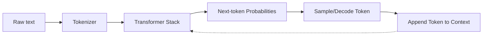

**What to internalize:** an LLM isn't "looking up facts." It's learning statistical patterns of language and using them to generate the next token—again and again—until it finishes.

---

## 02 — Single-pass LLMs

*Jan 1, 2023*

The first wave of real-world LLM products were basically ***single-pass generation systems***:

- You provide a user prompt
- A system prompt sets behavior ("be helpful", "be concise", "be formal")
- The model generates a response

This powers a lot of classic "AI assistant" features (one's available in Siri):

- rewrite to be shorter/formal/friendly
- summarize a doc
- classify sentiment/intent
- draft an email or a paragraph

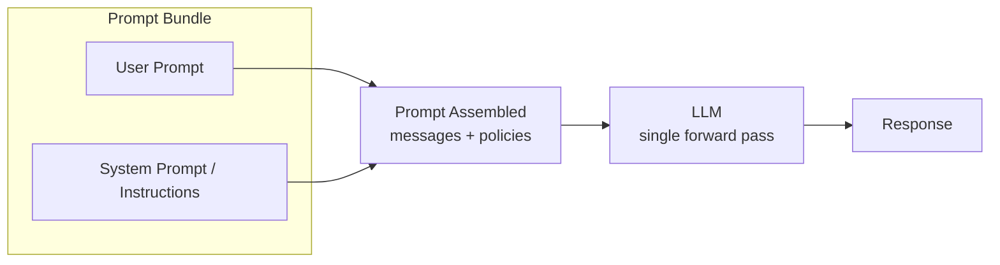

**Limitation:** this system is trapped inside its context window. If the required info isn't in the prompt (or the model's training), it must guess.

---

## 03 — Single-pass with RAG

*Mar 1, 2024*

RAG is the first major "unlock" because it answers the obvious question:

*What if the model could see **relevant external information** at answer time?*

Instead of relying purely on the model's internalized knowledge, you:

1. Retrieve relevant documents (from files, databases, or the web)
2. Stuff the best chunks into the context
3. Generate the answer with citations

This is exactly the core idea of [Retrieval-Augmented Generation (Lewis et al., 2020).](https://arxiv.org/abs/2005.11401)

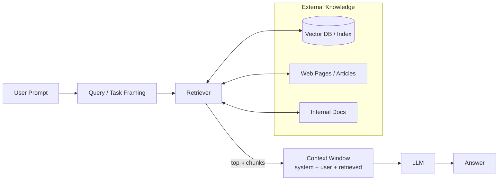

### "Internet access" timeline (and why it's still RAG)

People often say "GPT-4 got internet," but product-wise even when it feels like "the model is online," what's typically happening is:

- fetch/search happens outside the model
- results are inserted into the prompt
- the model generates from those snippets

So it's still "single-pass," just **with better context**.

---

## 04 — Reasoning models

*Sep 5, 2024*

RAG solves *grounding*. But it doesn't automatically solve *multi-step thinking*.

Reasoning models are the next shift: models that are explicitly optimized to ***spend more time on planning, verifying, backtracking—rather than emitting the first plausible answer.***

OpenAI's o1-preview is described as a series of models "designed to spend more time thinking before they respond." ([OpenAI](https://openai.com/index/introducing-openai-o1-preview/))
And the broader ecosystem saw similar momentum, including open releases like DeepSeek-R1 (Jan 2025). ([DeepSeek API Docs](https://api-docs.deepseek.com/news/news250120))

Meanwhile, general flagship models (like GPT-4o) improved latency + multimodality, making them better foundations for interactive systems. ([OpenAI](https://openai.com/index/hello-gpt-4o/))

### What changes in practice?

- **Plans become dynamic:** the system can revise its approach mid-flight.
- **Outputs become less "one-shot":** it may "think", check, and only then answer.
- **Non-determinism becomes a feature:** different attempts can explore different solution paths.

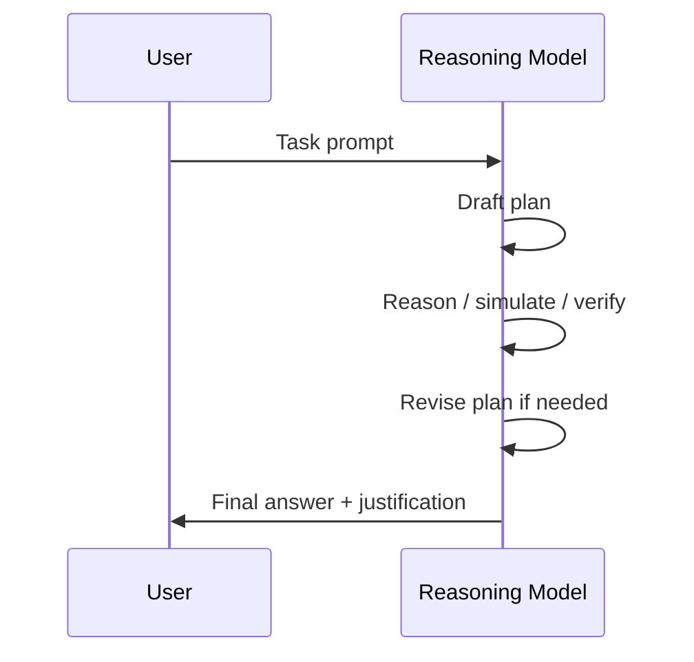

---

## 05 — Agents are here!

*Jan 23, 2025*

Now the big definition:

***An agent is a reasoning-capable model with access to tools***.

A tool can be anything: a weather API, database query endpoint, code runner, ticketing system, web browser, calendar, payments—whatever you expose behind an interface.

OpenAI's function calling is a major inflection point because it made the tool use *reliable* (structured inputs/outputs).

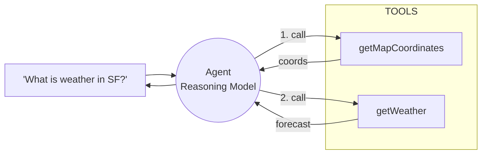

### MCP: the "USB-C moment" for agent tool/data access

Anthropic introduced the **Model Context Protocol (MCP)** as a standardized way to connect LLM applications to tools and data sources. ([Anthropic](https://www.anthropic.com/news/model-context-protocol))
OpenAI later added support for **remote MCP servers** in its Agents SDK, signaling convergence around shared patterns. ([OpenAI](https://openai.com/index/new-tools-and-features-in-the-responses-api/))

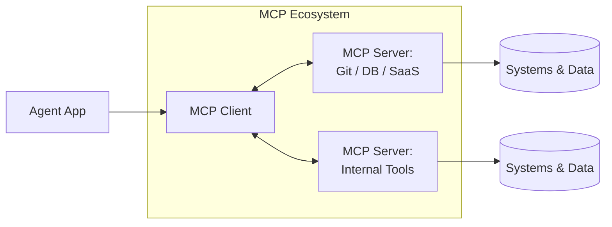

---

## 06 — Agents got skills

*Oct 16, 2025*

The modern bottleneck isn't "find the magic prompt." It's:

***Design the right context*** so the model can predict the right next tokens.

That's why "**context engineering**" is increasingly discussed as the practical craft: deciding what to retrieve, what rules to include, what state to keep, what tool schemas to expose ([Context Engineering Guide](https://www.promptingguide.ai/guides/context-engineering-guide))

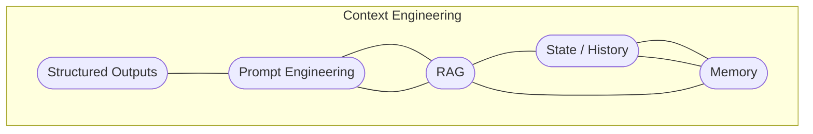

Once agents got access to context, the industry quickly wanted to reuse:

- "When asked about X, do Y steps"
- "Use these tools"
- "Follow these rules"

That **reusable bundle becomes a skill.** OpenAI's "GPTs" product direction (Nov 2023) popularized the idea of user-defined agents (custom instructions + optional actions/tools packaged into a shareable unit) while Claude 3.5 Sonnet also demonstrated advanced action modalities.

---

## 07 — Agents got actions

*Oct 1, 2025*

Reading data is great. The real disruption is acting.

***Once tools started mutating, the agent became a workflow engine***

- create a ticket
- purchase goods
- open a PR
- schedule a meeting
- run a migration
- send a message

There are multiple "action modalities":

1. **API tool calls** (best: structured + auditable)
2. **GUI automation ("computer use")** where the model drives a browser/desktop UI (powerful but riskier). Public "computer use" style capabilities have been showcased broadly in the ecosystem (e.g., Claude 3.5 Sonnet "computer use" references in platform announcements).

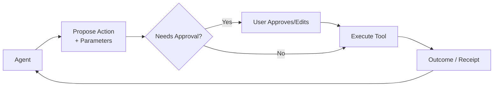

**The new hard problem:** security. The moment an agent can act, you must defend against prompt injection, confused-deputy behavior, and overbroad permissions. MCP itself now has dedicated security best-practice guidance. ([Model Context Protocol](https://modelcontextprotocol.io/specification/draft/basic/security_best_practices))

---

## 08 — Agents got agents

*Jul 29, 2025*

As soon as you have one capable agent, we realized it's better to **split roles**:

- a planner that decides steps
- a researcher that gathers context
- a coder that implements
- a reviewer that checks policies
- a test runner that validates

Frameworks like AutoGen helped formalize multi-agent collaboration patterns. **Each agent can have its own prompts, persona and tools**. More importantly it saves a singular agent from having context overload and can delegate/handoff tasks to sub-agents.

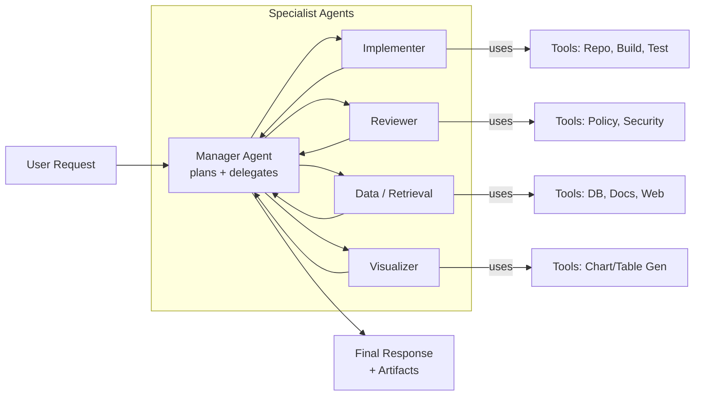

**Why it works:**

- narrower prompts per role = less confusion
- role-specific tool permissions = safer
- parallelism and independent verification = fewer silent failures

---

## 09 — Always-on agents

*Sep 1, 2025*

Single-shot agents are helpful. But the dream is:

"***The agent is a stateful engine, compressing its history to maintain continuity while perpetually operating.***"

Two things made this practical:

### (1) Context window compaction + externalized memory

Long-running agents accumulate huge histories. Newer techniques allow them to

- drop old unnecessary context
- compress/summarize it
- store state externally and retrieve just-in-time

OpenClaw documents "compaction" as summarizing older conversation into a compact entry and keeping recent messages intact, retrying the request with compacted context. ([OpenClaw](https://docs.clawd.bot/concepts/compaction))
Claude launched its compaction in July 2025 within Claude Code ([Release](https://support.claude.com/en/articles/12138966-release-notes))

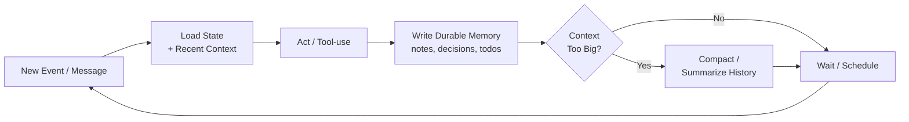

### (2) Continuous autonomy loops ("Ralph Wiggum loop")

The "Ralph Wiggum technique" popularizes the idea of keeping the agent in an outer loop:

- run
- verify completion
- retry with feedback
- repeat until actually done

Vercel's `ralph-loop-agent` repo describes it explicitly as a continuous loop methodology. ([GitHub](https://github.com/vercel-labs/ralph-loop-agent))

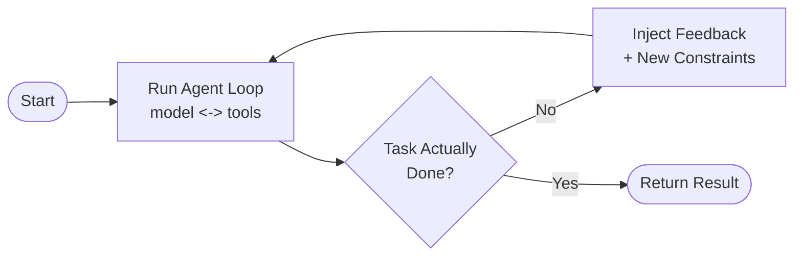

---

## 10 — What's next?

We're entering the phase where **interoperability, security, and evaluation** matter as much as raw model IQ.

### 1) The "open agentic web"

Major platforms are pushing the idea that agents should interoperate across vendors and services—an "agentic web." ([Reuters](https://www.reuters.com/business/microsoft-wants-ai-agents-work-together-remember-things-2025-05-19/))
This pushes standards like MCP from "developer convenience" to "internet infrastructure."

### 2) Open standards + governance

There's momentum toward formalizing common building blocks (protocols, registries, agent manifests) under shared governance. ([Anthropic](https://www.anthropic.com/news/donating-the-model-context-protocol-and-establishing-of-the-agentic-ai-foundation))

### 3) Security becomes the main constraint

As agents gain permissions, the threat model explodes:

- prompt injection becomes action hijacking
- tool supply chains become attack surfaces
- agent memory becomes a data exfiltration channel

Security guidance and risk analyses for MCP-style systems are already emerging from multiple credible orgs. ([Model Context Protocol](https://modelcontextprotocol.io/specification/draft/basic/security_best_practices))

### 4) Better "agent ops": observability, evaluation, guarantees

- traces (what tools were called and why)
- policy proofs (what was allowed/blocked)
- eval harnesses for workflows (not just benchmarks)
- reproducibility knobs (temperature, tool determinism, caching)

### 5) Personal agents: local-first + privacy + on-device inference

The "always-on" story will increasingly be:

- local storage for memory
- user-owned credentials
- minimal data leakage
- selective cloud escalation for heavy tasks

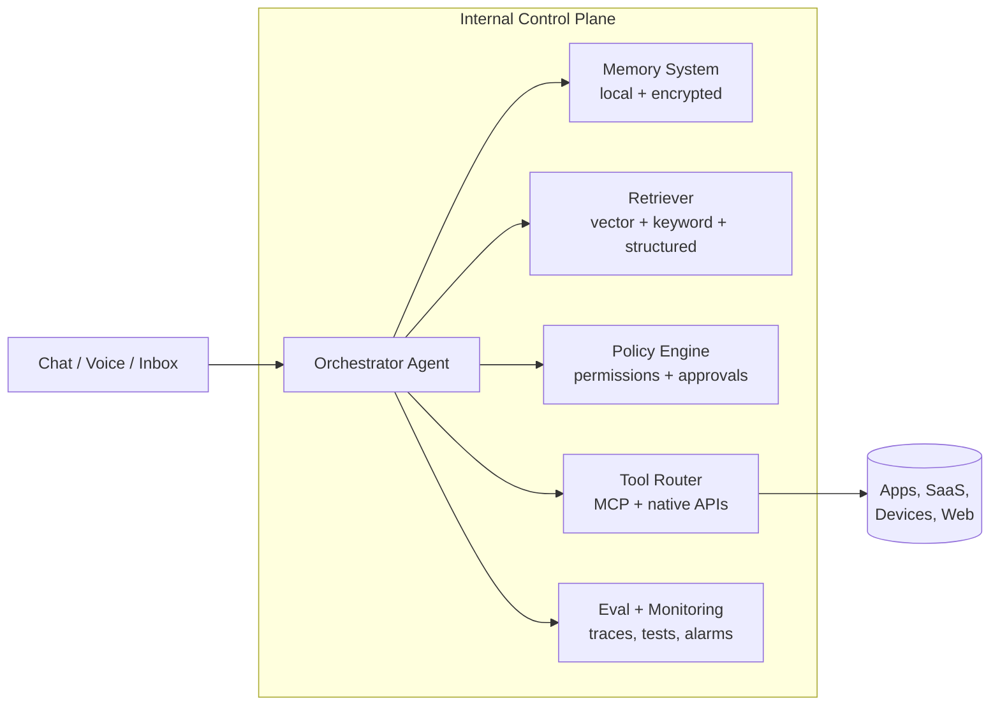

---

## Timelines

| Year | Milestone | What changed |
| --- | --- | --- |
| 2017 | Transformers ("Attention is All You Need") | Scalable sequence modeling via self-attention became the backbone of modern LLMs. |
| 2020 | RAG (Retrieval-Augmented Generation) | Retrieval became a first-class way to ground generations in external sources. |
| 2022–2023 | ChatGPT "moment" | Chat UX + instruction following made LLMs mainstream. |
| Mar 2023 | GPT-4 + early tool ecosystem | Higher capability model + plugins/tools started bridging "text-only" into "do things". |
| Sep 2024 | o1-preview / reasoning models | Explicit chain-of-thought optimization shifted focus from "fast answer" to "correct answer." |
| Nov 2024 | MCP introduced by Anthropic | Standardized protocol for connecting agents to tools and data sources. |
| Jan 2025 | DeepSeek-R1 + open reasoning | Open-source reasoning models made the capability broadly accessible. |
| Mar 2025 | OpenAI Agents SDK + remote MCP | Major vendors converged on shared agent infrastructure patterns. |
| 2025+ | Multi-agent orchestration | Splitting complex tasks across specialized agents became production-grade. |
| 2025+ | Always-on agents + memory | Compaction, durable memory, and continuous loops enabled persistent agent systems. |
