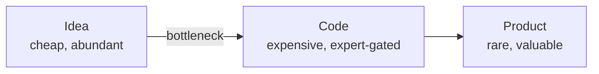
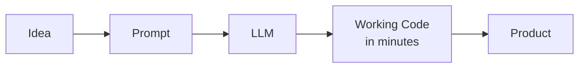
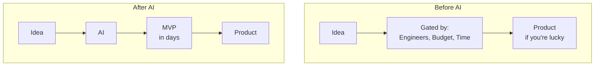
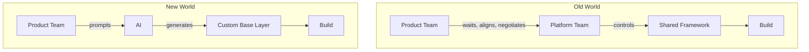
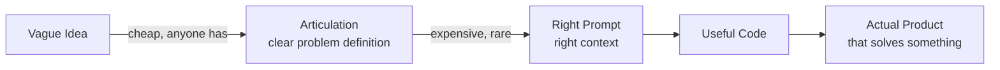

*From "show me the code" to "show me what you shipped."*

---

Linus Torvalds once said: ***"Talk is cheap. Show me the code."***

That line meant something real when it was written. Code was hard. It took years to get good at it, and the act of writing working software was expensive — in time, in cognitive effort, in the number of people who could actually do it. Ideas were the cheap thing. Everyone had them. The code was the proof.

I've been thinking about how completely that has flipped.

---

## 01 — Code

For most of software history, **writing code was the hard part**. Not just technically hard — economically hard. The bottleneck between an idea and a working product was almost always: who is going to build this, and how long is it going to take?

This scarcity gave code real weight. A clean, well-documented codebase meant someone had spent serious time on it. A production system meant a team of engineers had poured months into it. The effort was visible. The cost was legible. That's what made the artifact valuable — not just what it did, but what it represented in human terms.

Good documentation? Someone spent time on it. Organized architecture? Someone thought carefully. A working test suite? Real engineering discipline. These signals told you something about the people behind the code.

---

## 02 — The Flip

Then LLMs happened.

Not gradually — it happened fast enough that most people are still catching up to what it actually means. Work that used to take weeks compresses into days. Entire modules that used to require a senior engineer and a sprint cycle get generated in minutes. And not just working code — documented, organized, reasonably structured code.

The old signals broke. A well-commented codebase doesn't tell you anything anymore. A clean README could be generated. An organized file structure could be scaffolded. The forensic trail that told you a human had invested in this — gone. You can no longer look at a repository and confidently say anything about the effort behind it.

The code itself didn't get worse. In many cases it got better, or at least faster to produce. But its **value as a signal of effort collapsed**, and effort was quietly what a lot of the value was built on.

---

## 03 — The Printing Press Moment

Here's what I think most people are missing when they talk about this: **this is not just a productivity story. It's a democratization story.**

When the printing press arrived, it didn't just make books faster to produce. It changed who could participate — who could access knowledge, who could publish ideas, who could engage with what was being said and written in the world. Knowledge stopped being the property of institutions that could afford scribes.

What's happening now is structurally the same thing, one layer up. **Building software is being democratized.**

Before: if you couldn't code or couldn't afford a team that could, your idea stayed an idea. The code was the wall. Now the wall is dissolving. The question is shifting from *"can you build this?"* to *"do you have the right idea, and can you ship something that proves it?"*

That's a fundamentally different world. Not just for engineers — for anyone who has ever had a product idea and hit a wall because technical resources weren't available or willing.

---

## 04 — The Framework Power Shift

This is where I think the change gets underappreciated even inside engineering organizations.

For years, teams and platform groups had a quiet but real source of leverage: **they owned the base layer.** The internal framework. The shared design system. The SDK every product team had to build on. If you wanted to move, you worked through them — their roadmap, their priorities, their timeline.

That leverage is collapsing.

What I'm watching now: teams just build their own base layer. They describe what they need, the AI scaffolds it, and they ship on their own terms. Yes — this causes **massive code duplication**. The same utility functions reimplemented across ten teams. The same auth wrapper written six different ways.

But here's the honest reason this happens: 99% of what they need is standard, and the shared framework covers it. The problem is that **1%** — the edge case, the workflow that doesn't fit the abstraction, the requirement that would take three sprints to get onto someone else's roadmap. Rather than wait, they build the whole thing themselves. When the cost of generating a base layer is near zero, that trade-off is rational. It's *faster* and it *unblocks them completely.*

The power of owning a framework used to be real organizational leverage. Teams moved slowly because they had to move through you. That leverage is gone. Any team that can articulate what they need can now get it built, on their terms, immediately.

---

## 05 — The Slop Problem

There's a darker side to all of this, and it's worth naming.

When anyone can generate a codebase, the **provenance of code becomes meaningless.** You can't tell who wrote it, whether they understood it, or whether the person who shipped it could debug it if something broke at 2am. The human accountability that used to be baked into the artifact — the knowledge that this specific engineer understood this system — dissolves.

Kailash Nadh calls this "slop." Not because AI-generated code is necessarily defective. Often it isn't. But because its **infinite reproducibility makes it feel weightless.** It was cheap to produce. It can be regenerated. The moral and emotional weight of human craft — the thing that made a codebase feel like someone's work — isn't there.

This matters for something beyond aesthetics. The generation of engineers learning to code right now risks never building the foundational intuition that comes from writing things line by line and watching them break. That intuition — knowing *why* something fails, not just that it fails — is hard to develop if you've always had a model holding your hand.

---

## 06 — What's Actually Expensive Now

If code is cheap, what's left?

***The idea. The judgment. The ability to articulate what needs to exist and why.***

This is the inversion Torvalds didn't anticipate. Talk is no longer cheap — at least, the right kind of talk. The ability to describe a problem precisely enough that something useful gets built is now the differentiating skill. Not syntax. Not knowing the right library. **Knowing what to build.**

And paired with that: the ability to **ship fast and show something real.** The teams winning right now aren't the ones writing the best technical documents. They're the ones showing up to the next conversation with something you can click on. Something that exists. The path from idea to working thing has compressed so dramatically that there's less and less excuse for staying in the idea phase.

---

## 07 — Show Me the Product

So here's my version of the inversion:

- Torvalds: *"Talk is cheap. Show me the code."*
- Nadh: *"Code is cheap. Show me the talk."*
- Me: ***"Code is cheap. Show me the product."***

Articulation matters. Architectural thinking matters. But what matters most is being able to put something real in front of someone. An MVP. A prototype. Anything with a URL and a user flow. The cost of going from idea to something demonstrable is low enough now that the question is simply whether you're willing to do it.

The printing press didn't make writing easier to master. It made distribution cheap, which meant the quality of the ideas started to matter more than the access to the press. This is the same dynamic, one layer up.

Code is getting cheap. The question that remains — the real question — is whether you have something worth building, and whether you'll ship it.

---

*Inspired by and in commentary of:*
- *[Code is Cheap. Show me the Talk.](https://nadh.in/blog/code-is-cheap/) — Kailash Nadh*
- *[Ideas Over Implementation](https://boz.com/articles/ideas-implementation) — Boz*
