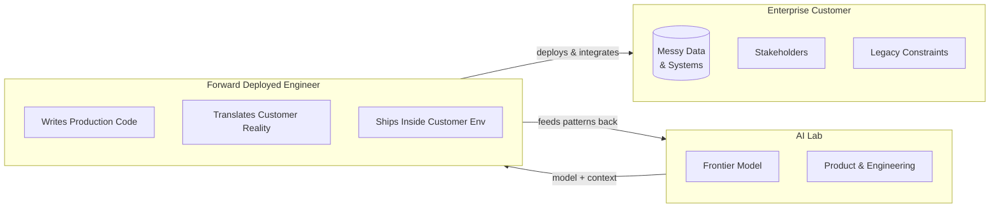

*On a role that's less about writing code and more about understanding people.*

---

---

The title has been stuck in my head for a few weeks now. **Forward Deployed Engineer.** Not "customer engineer." Not "solutions engineer." Not "field engineer." Something about the word *forward* and the word *deployed* together does something specific. It sounds like you're being sent somewhere uncomfortable on purpose. Like the role itself is admitting upfront that the work happens somewhere hard.

I think that framing is exactly right. And it tells you more about the job than any job description does.

## The problem this role actually exists to solve

Here's a number worth sitting with: **95% of enterprise generative AI pilots delivered no measurable business impact.** Not because the models were bad. The models are fine — better than fine. The failure was in what happens between "we have a capable AI" and "this AI is useful inside this specific company."

That gap is enormous. And it's not a technical gap in the traditional sense. It's a context gap. Every enterprise has a different data architecture, a different approval process for touching production systems, a different legal team with different concerns, a different definition of what "working" means. The model doesn't know any of that. The product team at the AI company doesn't know any of that. The only way to bridge it is to put someone physically inside it.

That's the job. That's what an FDE does. They go forward — into the customer's environment — and they ship software from inside it.

## What the work actually looks like

I've spent time reading about what this role involves in practice, and what surprised me most wasn't the technical complexity. It was the distribution of the work.

An FDE's time splits roughly 40% engineering, 60% everything else — stakeholder conversations, translating between the customer's domain vocabulary and technical reality, figuring out which team owns which data pipeline, identifying the actual decision-maker versus the person in the room, knowing when to push and when to slow down.

That 60% is what makes the role different from every other engineering job title I can think of. A software engineer's primary output is code. An FDE's primary output is a working system inside a customer's environment — and getting there requires a different kind of work.

There's a specific skill involved in sketching a routing architecture live on a screen while a customer's stakeholders watch, confirming feasibility in real-time against systems you've only known about for two weeks, and committing to a working prototype within days. That's not just coding. That's a kind of confidence that comes from being genuinely embedded — from having earned enough context to make calls on the spot.

A Solutions Engineer does something adjacent but different. They show up pre-sale, build a compelling demo, prove the concept, and then move on. The deal closes and they're gone. The FDE is the person who shows up after the deal closes, when the demo is behind you and the messy reality of production begins. They own it from that point forward. No moving on.

## The part I find most interesting

What keeps drawing me back to this role is what it says about the skills that matter most right now.

For a long time, the clearest path for an ambitious engineer was depth. Get better at the craft. Write cleaner code, understand systems more deeply, build more sophisticated abstractions. The engineering career ladder rewarded that. Specialization was the move.

The FDE flips this almost entirely. The technical skill is table stakes — you have to be good enough to write production code in an unfamiliar codebase, under time pressure, with incomplete documentation. But the real differentiator is something harder to put on a resume: the ability to sit inside a system you don't fully understand yet, earn the trust of people who didn't hire you, and build something useful before you've figured everything out.

That's a tolerance for ambiguity that most engineers spend their careers trying to eliminate, not develop. The FDE has to be comfortable with it as a permanent condition.

There's something almost uncomfortable about how un-engineered that skill is. You can't practice it with LeetCode. You can't train it with system design interviews. It comes from experience working with real humans on real problems where the requirements are unclear and the stakes are actual.

## A thought on what this means for AI companies specifically

The AI labs hiring FDEs in large numbers right now are essentially admitting something that took the industry a while to say out loud: the hard problem was never the model.

OpenAI just launched an entire subsidiary focused on deployment. Anthropic formed a joint venture worth over a billion dollars specifically to embed engineering inside enterprise customers. These are large organizational bets that the value in AI isn't in the capability — it's in the successful transfer of that capability into specific human contexts.

I find this clarifying. It means the companies building the most powerful models in the world have looked at the problem and concluded that model capability alone doesn't get you there. You need people who can go somewhere uncomfortable and make it work anyway.

## The career path question I don't have a clean answer to

One thing I keep wondering: is this a role people grow *into*, or one they grow *out of*?

The FDE life is intense by design. You're constantly context-switching between organizations, industries, and problems. You're always the outsider with a short window to become useful. You're responsible for outcomes in environments you don't control. That's energizing for some people. For others, it's exhausting.

My instinct is that the FDE role produces something valuable over time — a pattern-recognition for how different organizations work, a fluency in translating between technical and business reality, a confidence in ambiguous situations — that compounds in interesting ways. Someone who has done this well for five years understands how enterprises actually work in a way that very few people do.

Whether that leads somewhere specific, I genuinely don't know. It might produce a certain kind of builder who is unusually well-suited for the next wave of problems. Or it might be one of those roles that's extremely valuable right now, for exactly the reasons the moment requires it, and looks different in a few years as the tools for deployment mature.

## What I actually take from all of this

The thing I come back to is that the Forward Deployed Engineer might be the most human engineering job in an AI-first world. Not because it's easier or softer than other roles — it's not — but because the skill at its center is irreducibly human: understanding a messy, specific, political, irrational human system well enough to build something that works inside it.

Models can generate code. They can't sit in a room with a customer's legal team and figure out what's really blocking this and who has the authority to unblock it and what framing will make the next meeting go differently.

That's the work. And the title is honest about where it happens: forward, in the difficult place, by design.
